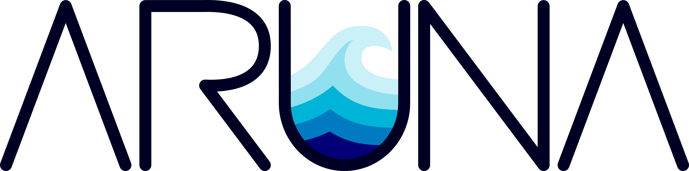

[](https://www.rust-lang.org/)
[](https://github.com/arunaengine/aruna/blob/main/LICENSE-APACHE)
[](https://github.com/arunaengine/aruna/blob/main/LICENSE-MIT)

[](https://codecov.io/gh/ArunaStorage/aruna)
[](https://deps.rs/repo/github/ArunaStorage/aruna?path=components%2Fserver)
___

<p align="center">
    <picture>
    <source media="(prefers-color-scheme: dark)" srcset="./img/aruna_white_font.png">
    
    </picture>
</p>

<br>

# A FAIR, federated data orchestration engine

> [!WARNING]
> Work in progress! You are viewing the upcoming version 3. See the [v2](https://github.com/arunaengine/aruna/tree/v2) branch for the latest stable release. 

Aruna is a federated peer-to-peer data management framework that enables organizations to share and organize data and metadata without handing over control to a central platform. 

## Features

- **Sovereign trust model**: Each node belongs to one organization. Realms define shared trust between them.
- **Fine-grained access control**: Path-based permissions with wildcard support and group-based roles.
- **S3-compatible interface**: Every node exposes an [S3 API](https://docs.aws.amazon.com/AmazonS3/latest/API/API_Operations_Amazon_Simple_Storage_Service.html) for data access.
- **Virtualized buckets**: Buckets are virtual collections of local and remote data resources, with configurable materialization behavior.
- **Extensible storage backends**: Support for a variety of storage backends through OpenDAL
- **Standardized metadata**: Metadata is stored as [RO-Crate](https://www.researchobject.org/ro-crate/) JSON-LD enabling rich, interoperable descriptions of datasets, files, and processes.
- **Powerful metadata manipulation**: RO-Crates can be created, edited and viewed through a SPARQL query.
- **Distributed full-text search**: Per-node [Tantivy](https://github.com/quickwit-oss/tantivy) indexes with fan-out queries and authorization filtering
- **Built-in replication and synchronization**: Metadata and data are replicated across nodes with automatic conflict resolution.
- **Interoperable using open standards**: [OIDC](https://openid.net/connect/) for authentication, [GA4GH DRS](https://www.ga4gh.org/product/data-repository-service-drs/) for data referencing, [OAI-PMH](https://www.openarchives.org/pmh/) for metadata harvesting
- **Easy deployment**: Run a node as a single binary or as a multi-cluster deployment.

## Architecture and Goals

Aruna is built for research data that does not live in one place, and often cannot be moved into one. Universities, institutes, labs, archives, repositories and infrastructure providers each have their own storage systems, policies, identities, and responsibilities. A central platform can be convenient, but it also creates a new point of control and tends to clash with legal, organizational, or practical constraints. Aruna takes a different approach: every participating organization runs its own node, keeps authority over its data, and still joins a shared network for discovery, access, replication, and collaboration.
 
The system is organized around **realms**. A realm is an organizational trust boundary, such as an institute, department, consortium, or project network. Each node belongs to one realm, and realms can establish trust with each other when collaboration requires it. Trust is not the same as access. A trusted partner does not automatically gain permission to read or modify data. Access stays explicit, granted through groups, roles, and path-based permissions. Data sits with the organization responsible for it, while researchers can still work across institutions.

### Data, metadata, and access

Each Aruna node exposes an **S3-compatible API**, so researchers can keep using the tools, scripts, workflow systems, and libraries they already have instead of learning a new storage protocol. Buckets are virtual collections that mix local data, replicated data, and references to remote resources. To a user, this looks like one coherent access point. Underneath, Aruna tracks where data actually lives, which permissions apply, and whether an object should be materialized locally or fetched on demand.
 
Metadata is part of the core system, not an external catalog bolted on afterwards. Descriptions are stored as **RO-Crate JSON-LD**, so datasets, files, people, instruments, workflows, software, and process runs can be described in a shared format. These descriptions live in a CRDT-based triple store, which allows concurrent edits on different nodes and merges them without a single authority arbitrating the result. Management resources such as users and groups follow the same idea through Automerge documents, which lets nodes keep working through network outages and reconcile state once they reconnect.
 
File contents go into a content-addressed blob layer. Objects are hashed with **BLAKE3**, making integrity checks and deduplication part of the storage model rather than a separate step. If the same file shows up under different paths or on different nodes, it is recognized by its content instead of its location. Replication uses Bao-tree verified streaming, so data can be checked incrementally as it arrives.

### Network and research workflows

The network layer is built on **iroh**, which gives Aruna a peer-to-peer foundation for node discovery, authenticated communication, and direct exchange between nodes, even if they are behind NATs or firewalls.
 
For researchers, the data remains where it is, but becomes easier to find, describe, access, replicate and incorporate into workflows. Familiar S3 tooling keeps working, while Aruna adds shared metadata, authorization, replication, provenance, and standards-based interoperability on top of the existing infrastructure.

Aruna serves as a base layer for larger research infrastructures. Distributed full-text search, GA4GH DRS identifiers, OAI-PMH harvesting, GA4GH TES-based compute execution, CEL-based policy enforcement, event subscriptions, and transparent request forwarding all rest on the same foundation: sovereign nodes, shared metadata, verified data exchange, and open interfaces. 

The goal is to support FAIR data practice in a way that matches how research actually works, distributed, collaborative, policy-bound, and owned by many parties at once.

## Getting Started

The quickest way to try Aruna is a local 3-node demo deployment.

### Prerequisites


#### For local builds:

- Rust `1.95.0+` (for source builds)
- OpenSSL development headers
- `mold` linker

#### For local test deployments:

- `curl` (`ss` for cluster setup)
- `docker`
- `docker-compose`
- `just` (optional, for convenience)

### Run a single node with an external identity provider

Start one node with:

```bash
just local
```

or invoke [scripts/local_deploy.sh](scripts/local_deploy.sh) directly.

The default example configuration exposes:

- the REST API and Swagger UI on `http://127.0.0.1:3000/swagger-ui`
- the S3 endpoint on `http://127.0.0.1:1337`

### Evaluate a local cluster

For a quick end-to-end evaluation, run:

```bash
just local-cluster
# or
just local-cluster-oidc
```

This demo deployment:

- builds the workspace in release mode
- launches 3 local Aruna nodes
- waits for readiness at `http://127.0.0.1:<port>/swagger-ui`
- writes per-node logs and `summary.txt` to `target/test-deploy/`
- prints an `ADMIN_TOKEN=...` line for use in authenticated API calls during the session

Useful overrides:

- `ARUNA_TEST_DEPLOY_BASE_PORT` shifts the entire local port range
- `ARUNA_TEST_DEPLOY_EXIT_AFTER_READY=1` exits once the cluster is ready instead of keeping it running

`just local-cluster-oidc` extends the same 3-node smoke test with a local Keycloak instance.

### Run a single node from source

To run a node directly from source, copy the example environment file and start the main binary from the workspace root:

```bash
cp .env.example .env
cargo run -p aruna
```

The default example configuration exposes:

- the REST API and Swagger UI on `http://127.0.0.1:3000/swagger-ui`
- the S3 endpoint on `http://127.0.0.1:1337`

## State And Onboarding

A node started without an `ONBOARDING_SECRET` initializes a new realm on first boot and persists its identity under `STORAGE_PATH`. When this happens, the first management node also logs an initial local onboarding secret for the new realm.

Additional nodes join an existing realm by setting `ONBOARDING_SECRET` on their first boot.

Onboarding only takes effect on a fresh data directory. Once a node has persisted state, later `.env` changes — including a new `ONBOARDING_SECRET` — do not re-bootstrap or re-onboard it. To repeat an onboarding or bootstrap flow, point the node at a fresh `STORAGE_PATH`.

For a ready-made multi-node onboarding flow, use `just test-deploy` instead of walking through the onboarding APIs manually.

## License

The API is licensed under either of

 * Apache License, Version 2.0 ([LICENSE-APACHE](LICENSE-APACHE) or http://www.apache.org/licenses/LICENSE-2.0)
 * MIT license ([LICENSE-MIT](LICENSE-MIT) or http://opensource.org/licenses/MIT)

at your option. Unless you explicitly state otherwise, any contribution intentionally submitted for inclusion for Aruna by you, as defined in the Apache-2.0 license, shall be dual licensed as above, without any additional terms or conditions. 


## Feedback & Contributions

If you have any ideas, suggestions, or issues, please don't hesitate to open an issue and/or PR. Contributions to this project are always welcome ! We appreciate your help in making this project better. Please have a look at our [Contributor Guidelines](./CONTRIBUTING.md) as well as our [Code of Conduct](./CODE_OF_CONDUCT.md) for more information.